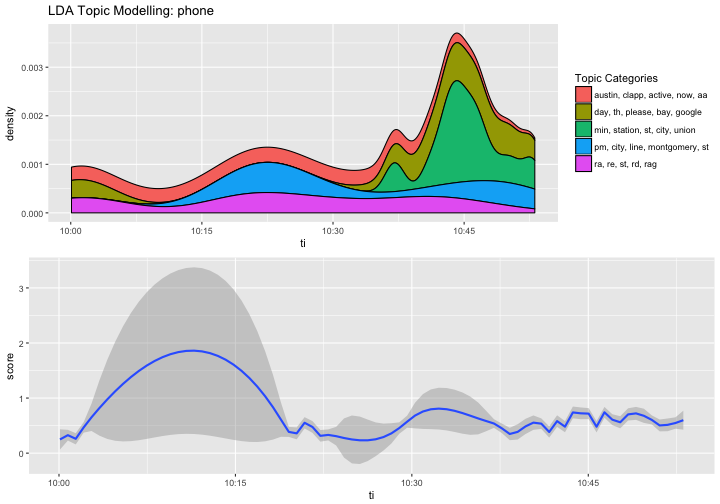
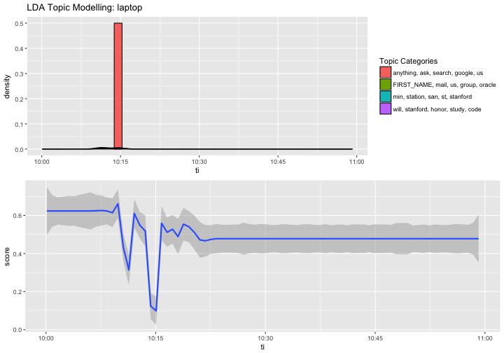

## Information Trustworthiness
>- An open research question!
>- 1. Database, machine learning, and natural language understanding
  - data/knowledge fusion
  - data veracity and source credibility
>- 2. Computational journalism 
  - automated fact-checking: also an engineering question?
  - combining currently available tools vs. "fundamental breakthroughs in multiple fronts"

---

## Factiness, Truthiness
>- 1. True/False value of a claim is importent, but...
  - It's not only about fact; it's also about the possiblity of having some "facts"
  - Nathan Jurgenson: "The facts of Obama’s birthplace mattered less..."
>- 2. Facts vs. "facty" info
  - "Factiness is the taste for the feel and aesthetic of 'facts'" 
  - We like to be informed, like, super informed: "facty" info is attractive whether it true or not

---

## Cyber Social Project and Information Trustworthiness
>- 1. Consumer-side media diet
  - Info presented vs. Info consumed
>- 2. Moment-by-moment granularity
  - Naturally-occurring data
>- 3. Duke Database Research Group's ClaimBuster
  - SVM trained on presidential debate texts
  - Has a REST API

---

## Factiness by Behavioral Categories


---

## Topic Modeling and Trend of the Mean Factiness Score: Phone


---

## Topic Modeling and Trend of the Mean Factiness Score: Laptop


---

## Trend of the Mean Factiness Score, 10-11 am: Phone


---

## Trend of the Mean Factiness Score, 10-11 am: Laptop


---

## Within-individual Statistical Analysis


```r
mdS[10:24]
```

```
##  [1] "                      Estimate Std. Error t value Pr(>|t|)    "
##  [2] "(Intercept)           0.581676   0.045817  12.696  < 2e-16 ***"
##  [3] "categoryFile System  -0.402358   0.089173  -4.512 6.68e-06 ***"
##  [4] "categoryGaming       -0.149181   0.046551  -3.205  0.00137 ** "
##  [5] "categoryMail         -0.140275   0.047586  -2.948  0.00323 ** "
##  [6] "categoryNews         -0.078319   0.047659  -1.643  0.10043    "
##  [7] "categoryOther        -0.090192   0.046055  -1.958  0.05029 .  "
##  [8] "categorySocial Media -0.116956   0.047699  -2.452  0.01427 *  "
##  [9] "categoryText Editing -0.335106   0.054631  -6.134 9.77e-10 ***"
## [10] "categoryText msg     -0.100751   0.058734  -1.715  0.08638 .  "
## [11] "categoryVideo        -0.184633   0.177150  -1.042  0.29739    "
## [12] "categoryWeb surfing  -0.118743   0.046576  -2.549  0.01084 *  "
## [13] "device                0.011148   0.008425   1.323  0.18587    "
## [14] "---"                                                           
## [15] "Signif. codes:  0 '***' 0.001 '**' 0.01 '*' 0.05 '.' 0.1 ' ' 1"
```


