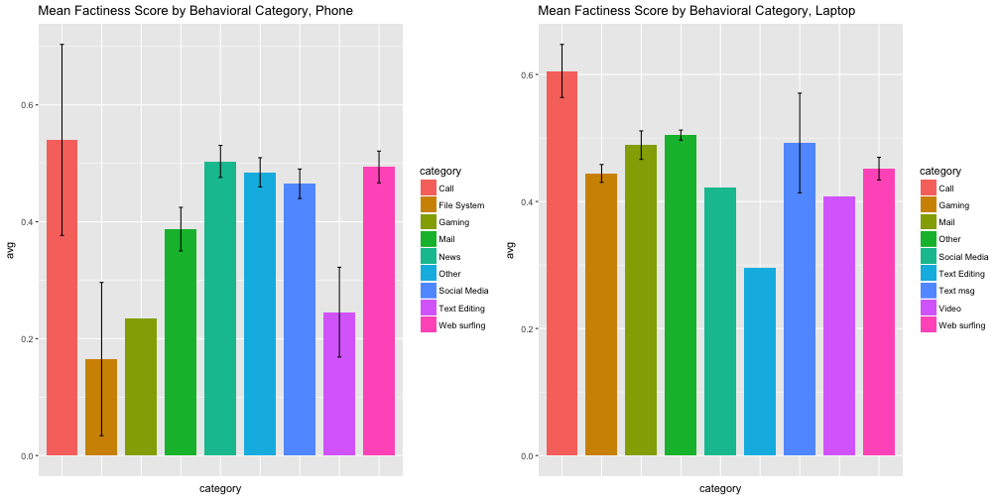
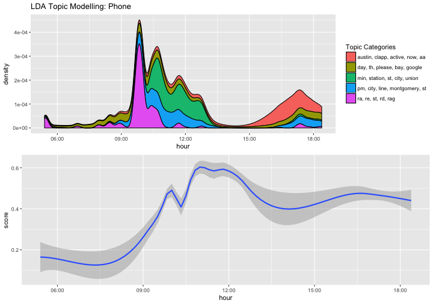
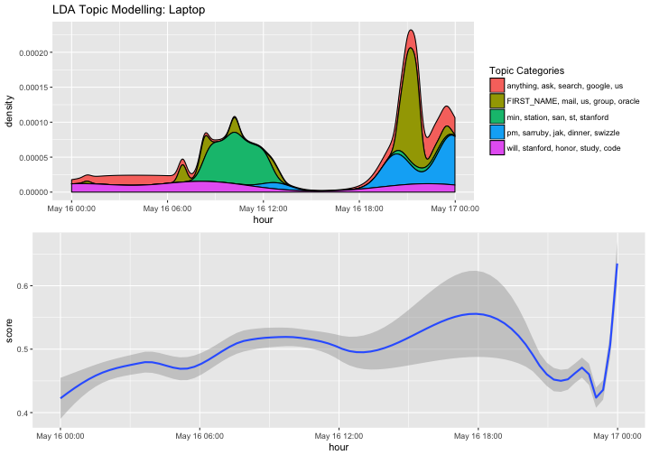

## Information Trustworthiness
>- 1. Database and machine learning
>- 2. Computational journalism 

---

## Cyber Social Project
>- 1. Consumer-side, moment-by-moment

---

## Factiness
>- 1. Duke's ClaimBuster API

---

## Factiness by Behavioral Categories

---

## Topic Modeling and Trend of the Mean Factiness Score: Phone

---

## Topic Modeling and Trend of the Mean Factiness Score: Laptop

